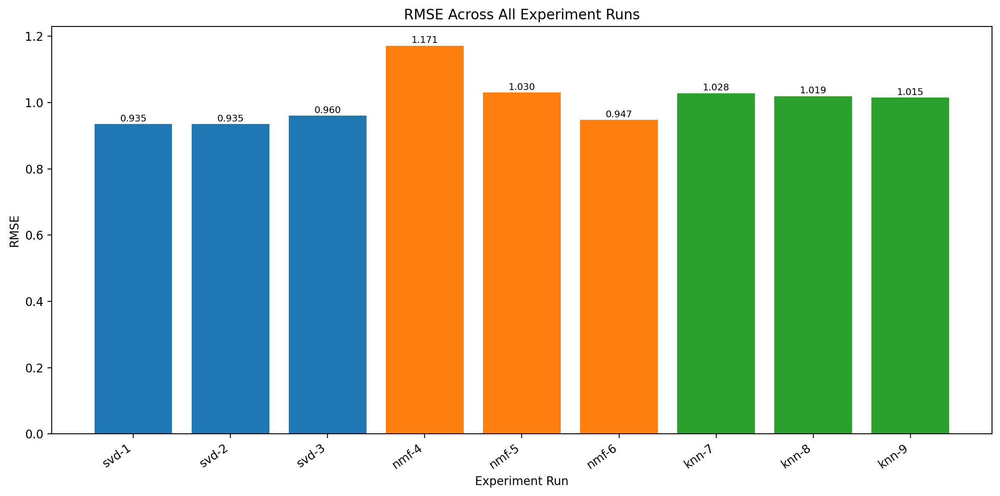
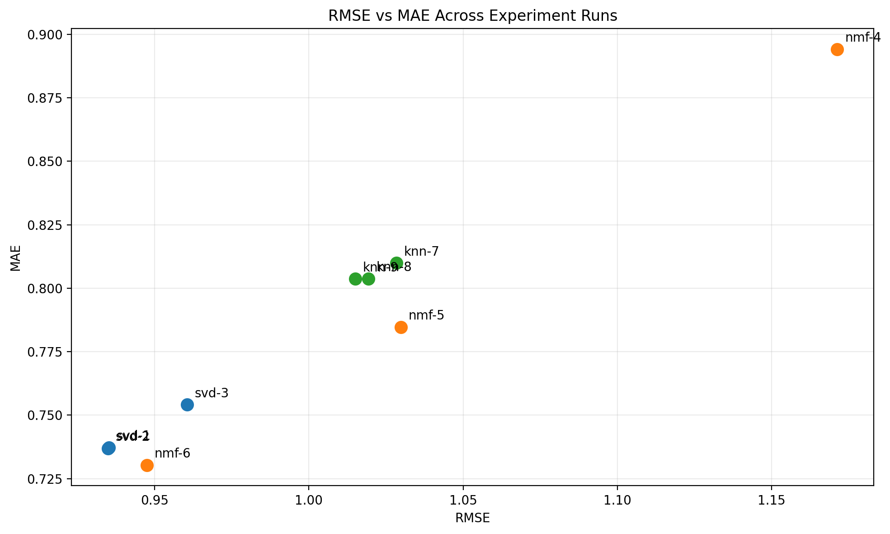
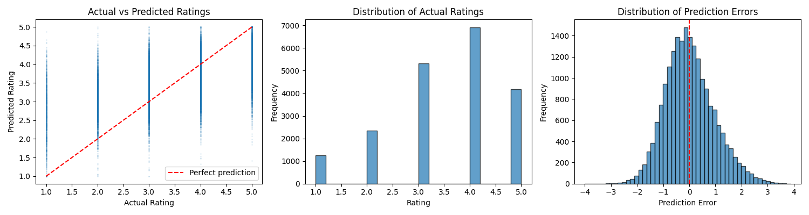

# Experiment Report

Generated: 2026-03-18 18:34:11

## Summary

- Total experiments: 9
- Successful: 9
- Failed: 0

## Results

| Model | Parameters | RMSE | MAE | Run ID |
|-------|------------|------|-----|--------|
| svd | {"lr_all": 0.005, "n_epochs": 20, "n_factors": 50, "reg_all": 0.02} | 0.9351 | 0.7372 | 6932f2248e8141f69abfbb1338cfeecb |
| svd | {"lr_all": 0.005, "n_epochs": 20, "n_factors": 100, "reg_all": 0.02} | 0.9349 | 0.7370 | bc075df5b3164616b448eeaf39c1abfb |
| svd | {"lr_all": 0.01, "n_epochs": 30, "n_factors": 150, "reg_all": 0.02} | 0.9605 | 0.7541 | 3abe408bee544ca89b5a0061567094f6 |
| nmf | {"n_epochs": 30, "n_factors": 30} | 1.1714 | 0.8941 | 7e34e52be1904784ba24f7c95b3c8e18 |
| nmf | {"n_epochs": 50, "n_factors": 50} | 1.0298 | 0.7847 | c7ba004bba0545638fe8f52f5f69b709 |
| nmf | {"n_epochs": 70, "n_factors": 100} | 0.9474 | 0.7304 | a8c119ee693845ff8358f4b19a5b7552 |
| knn | {"k": 20, "sim_options": {"name": "cosine", "user_based": true}} | 1.0284 | 0.8099 | 3e0ec67708c242fcbc4c154dbb1707a4 |
| knn | {"k": 40, "sim_options": {"name": "cosine", "user_based": true}} | 1.0194 | 0.8038 | 2bcd8c1e8cdb4164818d5e559656c27a |
| knn | {"k": 40, "sim_options": {"name": "pearson", "user_based": true}} | 1.0150 | 0.8037 | 548ad98c06094eac857ab5ad0c9eb6a5 |

## Best Model

- Configuration: `{"lr_all": 0.005, "model_type": "svd", "n_epochs": 20, "n_factors": 100, "reg_all": 0.02}`
- RMSE: 0.9349
- MAE: 0.7370
- Run ID: `bc075df5b3164616b448eeaf39c1abfb`

## Visualizations

### RMSE Across All Runs

### RMSE vs MAE Comparison

### Best Model Diagnostic Plot

## Recommendations

- Select `svd` with run ID `bc075df5b3164616b448eeaf39c1abfb` for production because it achieved the best RMSE (0.9349) while maintaining strong MAE (0.7370).
- Use the comparison charts above to justify why the selected configuration outperformed the other experiment runs.
- Keep the prediction distribution plot in the report as the diagnostic visualization for the chosen production model.
